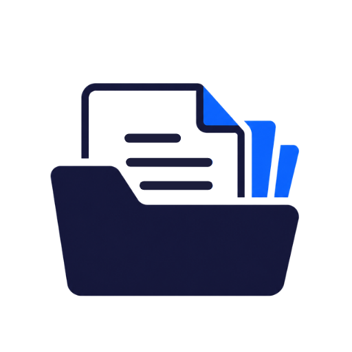

# ASM+ Google Cloud Marketplace

  
  &nbsp;&nbsp;&nbsp;
  

## Overview

Auritas Storage Manager (ASM+) is an enterprise document management application
for SAP environments. It centralizes document storage and access, connects
documents with SAP business processes, SAP SuccessFactors, and the Snowflake
platform, and provides web interfaces for administration, search, and document
viewing.

ASM Storage API is the central application API. Optional SAP Business and SAP
SuccessFactors connectors integrate with customer-approved systems and
credentials.

## Marketplace delivery and licensing

The current Google Cloud Marketplace product is being prepared as a **Standard
Kubernetes application** with a **Bring Your Own License (BYOL)** pricing model.
The Marketplace deployer installs the ASM+ Kubernetes resources into a GKE
cluster selected by the customer. It does not use Terraform to create a VPC,
GKE cluster, Cloud SQL instance, Cloud Storage bucket, DNS zone, or project IAM
configuration.

Customers obtain the ASM+ software license directly from Auritas. Google bills
the customer separately for the Google Cloud infrastructure used by the
deployment. Auritas is responsible for validating the ASM+ license in the
application.

## Customer-hosted prerequisites

The production deployment profile requires customer-controlled resources that
exist before the Marketplace deployment begins:

- A supported x86-based GKE cluster with sufficient CPU, memory, and storage.
- A PostgreSQL database reachable from the cluster. Cloud SQL for PostgreSQL is
  the recommended Google Cloud implementation.
- A Cloud Storage bucket for ASM+ document content.
- A Kubernetes service account configured through Workload Identity with the
  approved bucket permissions.
- Customer-managed DNS, HTTPS certificates, secrets, backups, and network
  connectivity to any enabled SAP systems.
- A valid ASM+ BYOL license obtained from Auritas.

See the [deployment and user guide](docs/USER_GUIDE.md) and the
[Marketplace readiness register](docs/MARKETPLACE_READINESS.md) before using
the package.

## Repository layout

- `marketplace/deployer/`: Standard Kubernetes deployer source and candidate
  Helm chart.
- `docs/USER_GUIDE.md`: customer deployment and operations guide.
- `docs/MARKETPLACE_READINESS.md`: verified items and release blockers.
- `docs/THIRD_PARTY_COMPONENTS.md`: third-party component inventory.
- `legacy/terraform-kubernetes/`: superseded Terraform Kubernetes onboarding
  material retained for traceability only.
- `SECURITY.md`: security and support guidance.

The Standard Kubernetes package is currently **pre-release**. Do not represent
it as Google-approved or production-ready until the readiness register shows
all release gates as complete.

This repository does not contain credentials, customer data, Terraform state,
or private application source code.

Copyright Auritas LLC. All rights reserved.
